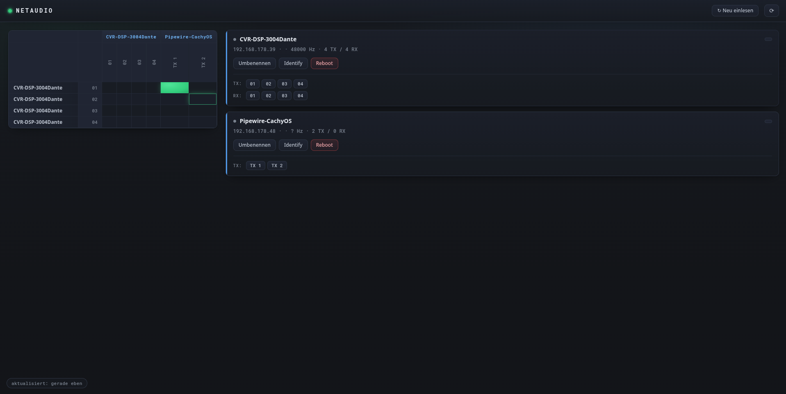

# netaudio Web-GUI

Browser-based Dante routing matrix + device management on top of the `netaudio` CLI.

> ⚠️ **Status: work in progress.** Everything here is under active development —
> expect bugs, rough edges, and breaking changes. Not yet recommended for
> production / live use.

## Features

- **Routing matrix** — click a cell to subscribe/unsubscribe; optimistic updates,
  crosshair hover, live status colors.
- **Search/filter** — filter the matrix and device panel by device or channel name
  (`/` focuses the search box).
- **Clean-up** — disconnect all routes of one RX device (header ✕) or the whole
  matrix ("Alle trennen").
- **Bulk routing** — route every channel of one device into another (device → device).
- **Scenes / presets** — save the whole matrix as a named scene and recall it
  (exact diff: adds what's missing, removes what's extra).
- **Per-device config** — sample rate, encoding, latency, AES67, preferred-leader,
  and per-channel gain (right-click a channel chip).
- **Monitoring** — clock leader/follower panel, per-device detail view, cell-color
  legend, dimmed offline devices.
- **Export / import** — download the current routing as JSON and re-apply it later.
- **UX** — light/dark theme (persisted), keyboard shortcuts (`?` for help),
  responsive mobile layout, and an in-memory audit log of changes (`/api/log`).

## Run

    ~/bin/inferno-gui            # starts the netaudio daemon + serves on 0.0.0.0:36342

Open http://<this-host>:36342/ from any device on the LAN.

### Demo mode (no hardware)

    NETAUDIO_GUI_DEMO=1 uv --project ~/src/netaudio-webgui run uvicorn netaudio_webgui.app:app

### Configuration (env vars)

| Var | Default | Meaning |
|---|---|---|
| `NETAUDIO_GUI_BIND` | `0.0.0.0` | bind address |
| `NETAUDIO_GUI_PORT` | `36342` | port |
| `NETAUDIO_GUI_TOKEN` | (unset) | if set, all `/api/*` require `Authorization: Bearer <token>`; append `?token=<token>` to the URL |
| `NETAUDIO_GUI_DEMO` | `0` | serve in-memory demo data |
| `NETAUDIO_BIN` | `netaudio` | path to the netaudio binary |
| `NETAUDIO_GUI_TIMEOUT` | `2.0` | mDNS scan timeout when the daemon is not running |
| `NETAUDIO_RELAY_HOST` | `127.0.0.1` | netaudio daemon relay host (for forced cache refresh) |
| `NETAUDIO_RELAY_PORT` | `9000` | netaudio daemon relay port |
| `NETAUDIO_GUI_PRESETS` | `~/.config/netaudio-webgui/presets.json` | where named routing scenes are stored |

## Keeping the view fresh

The netaudio daemon caches device state (channels **and** subscriptions). Changes made
through this GUI auto-trigger a daemon refresh, so they appear on the next poll. For changes
made **outside** the GUI (Dante Controller, channel-count edits, device restarts), click
**"↻ Neu einlesen"** to force the daemon to re-query. If a device fully dropped and
re-joined and a refresh isn't enough, restart the daemon: `netaudio daemon restart`.

## Tests

    uv --project ~/src/netaudio-webgui run --group dev pytest -q
